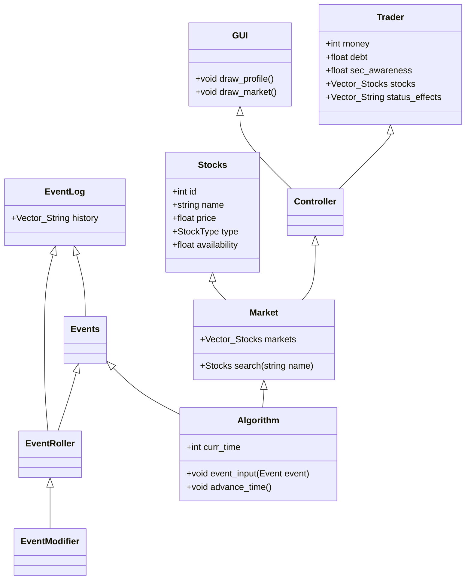

# Stock Market Simulator
## Overview
Stock Market Simulator is a Java-based computer game that simulates the dynamics of the stock market. In this game, players take on the role of traders, making financial decisions, managing their portfolio, and navigating various challenges in the stock market environment. 

## System Requirements
Java SE Development Kit (JDK) 19 or later

Git Bash 2.42 or Comparable version

Compatible with Windows, macOS, and Linux

Gradle 7.6.1 or Comparable version
## Getting Started
### Clone the Repository
```
git clone https://github.com/Regorh/Stock-Market-Simulator.git
```
### Navigate to the Project Folder
Use the cd (change directory) command to navigate to the proper folder for the project. An example is below:
```
cd stock-market-simulator
```
### Compile the Code Using Gradle
```
./gradlew build
```
### Run the Game Using Gradle
```
./gradlew run
```
### How to Play
Use the graphical user interface (GUI) to interact with the game.
Buy and sell stocks, manage your finances, and try to outperform the market while avoiding the consequences of your more nefarious actions. Pay off your debt and avoid the SEC and survive in the ruthless market as long as possible.

## Features
Simulated stock market with various stocks and market dynamics.
Player attributes include money, stress, and debt.
Random events affect the market and the player's decisions.
SEC (Securities and Exchange Commission) investigations and legal consequences for player actions.
User-friendly GUI for an engaging gameplay experience.

## High Level Design

### This game uses MVC structure

Classes:

User:
*This is owned by the Game Controller
*This will act as the player for the game.
*The User has a debt to pay off, and the SEC to avoid, this is the goal of the game.
*The User has the ability to own stocks as well as sell.
*The User can commit illegal actions by clicking a button, thus causing a random positive event to occur next turn.
	* This will cause suspicion to go up, if it reaches 100 the game ends
* if the User runs out of money the game ends
* Events can occur that will increase the players stress
	* if stress reaches 100 the game can also end
  
Stocks:
* This is owned by the Market
* These will act as the in-game counterpart to real life stocks,
* each stock has a price, type, and stability
* Events can affect the pricing of the stocks, determined by their stability
  
Market:
* This is owned by the Game Manager
* This owns Stocks
* There shall be a market that contains stock
* The market also has a stability, changing the average volitility of the market
* The market as a whole can also be effected by events

GameManager:
* This is owned by the Game Controller
* This owns the Market
* The game manager asks it's market to do some changes to its stocks, based on data the game manager holds, such as events

EventRoller:
* This is owned by the Game Controller
* This loads in events and event types from a editable text file
* it then will roll for events when asked by Game Controller
* Events are passed to the class that expects them, that class is resposible for event handling
	
Start UI:
*Owned by Game Controller
* Presents user with difficulty options for a new game
* difficulty changes the starting stress, capital, and SEC suspicion
* Leads the player into the main GUI
  
GUI:
* Owned by Game Contoller
* Shows all available stocks
* Allows for the buying and selling via buttons,
* shows the stats of the User
* This is the main way the user interacts with the game.
* allows for all events/ stocks to roll upon the selection of the next day button

Game Contoller:
* This is the main driver of the game
* Owns GUI, Start UI, GameManager, User, and EventRoller
* This runs through the actions performed by the user, 
* it is the MVC controller and observer, for what is pressed on the GUI for the frontend to the backend
  




## Contributors
Ali Elnour ali.elnour@slu.edu

Om Patel om.patel.1@slu.edu

Noah Guzinski noah.guzinski@slu.edu (nguzinskidev@gmail.com)

Rob Helme robby.helme@slu.edu
