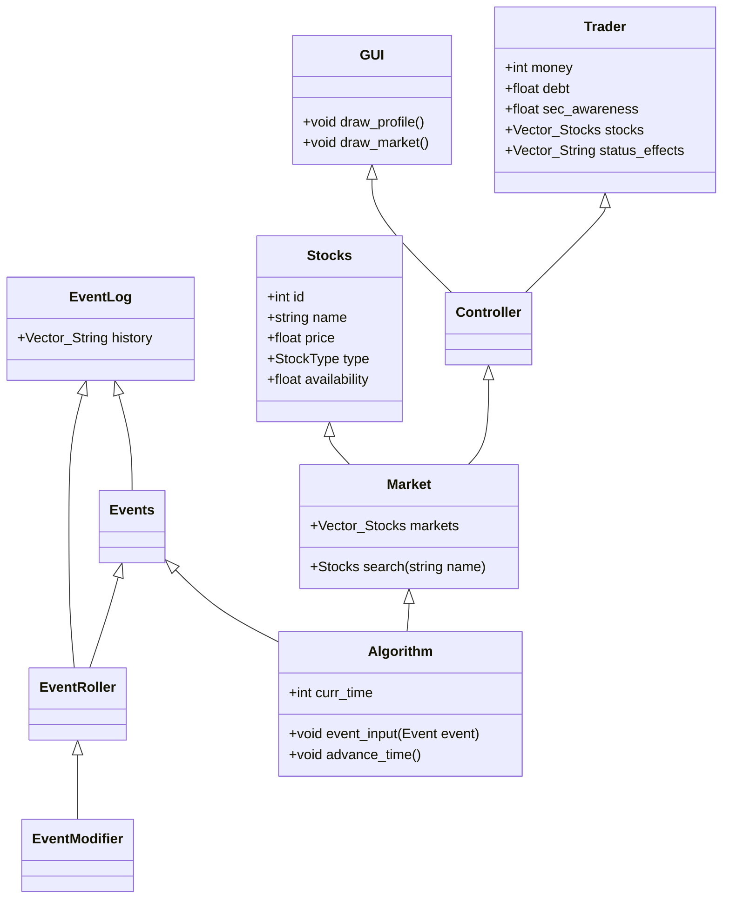

# Stock Market Simulator
## Overview
Stock Market Simulator is a Java-based computer game that simulates the dynamics of the stock market. In this game, players take on the role of traders, making financial decisions, managing their portfolio, and navigating various challenges in the stock market environment. 

## System Requirements
Java SE Development Kit (JDK) 19 or later

Git Bash 2.42 or Comparable version

Compatible with Windows, macOS, and Linux

Gradle 7.6.1 or Comparable version
## Getting Started
### Clone the Repository
```
git clone https://github.com/Regorh/Stock-Market-Simulator.git
```
### Navigate to the Project Folder
Use the cd (change directory) command to navigate to the proper folder for the project. An example is below:
```
cd stock-market-simulator
```
### Compile the Code Using Gradle
```
./gradlew build
```
### Run the Game Using Gradle
```
./gradlew run
```
### How to Play
Use the graphical user interface (GUI) to interact with the game.
Buy and sell stocks, manage your finances, and try to outperform the market while avoiding the consequences of your more nefarious actions. Pay off your debt and avoid the SEC and survive in the ruthless market as long as possible.

## Features
Simulated stock market with various stocks and market dynamics.
Player attributes include money, stress, and debt.
Random events affect the market and the player's decisions.
SEC (Securities and Exchange Commission) investigations and legal consequences for player actions.
User-friendly GUI for an engaging gameplay experience.

## High Level Design

Classes:

User:
This will act as the player for the game
This class shall have the following
* a number representing the user's capital
  	* if capital reaches 0 the game will end
* a list of owned stocks
* a number representing the suscpicion by the SEC
  	* if suscpicion is over max, the game will end
* a number representing the current debt of the user
* a numer representing the stress of the user
  	* if stress reaches a max the game will end

Stocks:
These will act as the in-game counterpart to real life stocks,
* stocks shall have a name visible to the user.
* sotcks shall have a price,
 	*each stock can be changed via events
  	*each stock price will also change based on the next day action

Market:
* There shall be a market that contains stock
* The market also has a stability, changing the average volitility of the market
* The market shall have its stability affected by events

GameManager
* The game manager shall own a market.
* The game manager shall change market prices based on alogrithmic rolls.
	* The game manager shall have the ability to take in events as a weight.
	* The game manager shall have default weights to if a market will go up or down
	* The magnitude of market change shall be determined in the algorithm given the stability of the market
* The game manager edit the weights and stocks to create a semi unpredictable, market

EventRoller:
* The Event roller shall roll events for both User and Market
* The Event roller shall hold multiple pre-decided events. 
  	* These events shall be cycled through randomly. 
	* There will be predetermined events that will occur if conditions in the market are met. 
	* events can effect the prices of stocks, the capital of the User, and any stats the User has
* events will make changes occur on the UI such as the stock prices listed, and display of description. 
	
Start UI:
* Presents user with difficulty options for a new game
* difficulty changes the starting stress, capital, and SEC suspicion
* Leads the player into the main GUI
  
GUI:
* The GUI will present the user with their trader profile.
* This profile will entail the stocks they hold, the markets they can trade in, and their overall profile. 
* The overall profile in the GUI will show the trader their debt, SEC suspicion, and the amount of capital they hold. 
* It will have buttons which the trader can click to buy, sell, perform illegal actions,
* It will also hold text boxes in which the trader can type in the amount they would like to buy or sell of a stock. 
* This will also show a list of events that have made an impact on the market




## Contributors
Ali Elnour ali.elnour@slu.edu

Om Patel om.patel.1@slu.edu

Noah Guzinski noah.guzinski@slu.edu (nguzinskidev@gmail.com)

Rob Helme robby.helme@slu.edu
